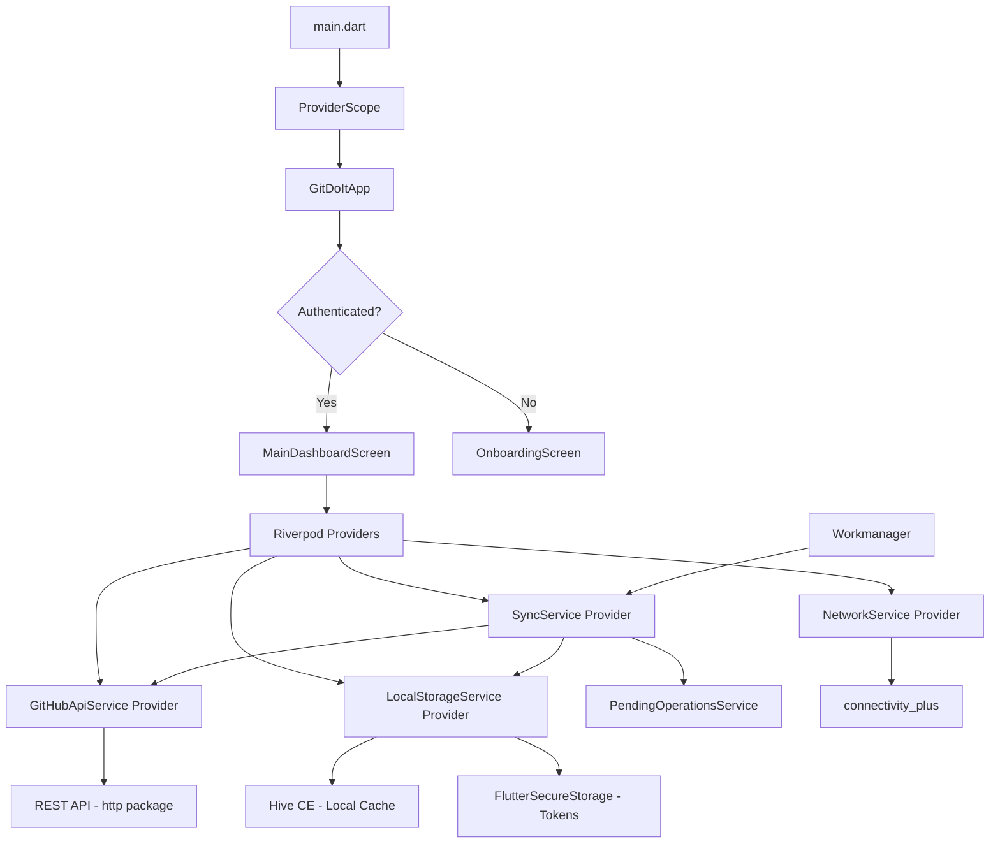

# GitDoIt — Dependency Update & Modernization Plan

**Branch:** `new-hope`  
**Date:** 2026-03-09  
**SDK constraint:** `^3.11.0`

---

## Executive Summary

The project is a Flutter offline-first GitHub Issues & Projects TODO manager using Riverpod 3, Hive, and REST/GraphQL APIs. After a thorough audit, I identified **unused dependencies**, **outdated packages**, **deprecated patterns**, and several areas where modern Flutter/Dart best practices would significantly improve maintainability, performance, and developer experience.

---

## Current State Analysis

### Dependencies Audit

| Package | Current | Status | Notes |
|---------|---------|--------|-------|
| `flutter_riverpod` | ^3.2.1 | ✅ Recent | Update to latest 3.x |
| `riverpod_annotation` | ^4.0.2 | ✅ Recent | Update to latest 4.x |
| `riverpod` | ^3.2.1 | ✅ Recent | Update to latest 3.x |
| `hive` | ^2.2.3 | ⚠️ Deprecated | Hive v2 is unmaintained; migrate to `hive_ce` or `isar` |
| `hive_flutter` | ^1.1.0 | ⚠️ Deprecated | Same as above |
| `path_provider` | ^2.1.5 | ✅ OK | Update to latest |
| `http` | ^1.6.0 | ✅ OK | Update to latest |
| `graphql_flutter` | ^5.2.1 | 🔴 UNUSED | Not imported anywhere in `lib/` — remove |
| `flutter_secure_storage` | ^10.0.0 | ✅ Recent | Update to latest 10.x |
| `flutter_markdown_plus` | ^1.0.6 | ✅ OK | Update to latest |
| `reorderables` | ^0.6.0 | ⚠️ Stale | Only used in one screen; consider `ReorderableListView` from Flutter SDK |
| `url_launcher` | ^6.3.2 | ✅ OK | Update to latest |
| `connectivity_plus` | ^6.1.3 | ✅ OK | Update to latest |
| `file_picker` | ^10.3.10 | ✅ Recent | Update to latest |
| `permission_handler` | ^12.0.1 | ✅ OK | Update to latest |
| `permission_handler_android` | 13.0.1 | ⚠️ Pinned | Should use caret `^` syntax |
| `flutter_screenutil` | ^5.9.3 | ✅ OK | Update to latest |
| `flutter_svg` | ^2.0.17 | ✅ OK | Update to latest |
| `cupertino_icons` | ^1.0.8 | ✅ OK | Update to latest |
| `package_info_plus` | ^9.0.0 | ✅ OK | Update to latest |
| `gql_dedupe_link` | 2.0.4-alpha+... | 🔴 UNUSED | Not imported anywhere — remove |
| `normalize` | 0.9.1 | 🔴 UNUSED | Not imported anywhere — remove |
| `cached_network_image` | ^3.3.1 | ✅ OK | Update to latest |
| `workmanager` | ^0.9.0+3 | ✅ OK | Update to latest |
| `shimmer` | ^3.0.0 | ✅ OK | Update to latest |
| `share_plus` | ^10.1.4 | ✅ OK | Update to latest |

### Dev Dependencies Audit

| Package | Current | Status | Notes |
|---------|---------|--------|-------|
| `build_runner` | ^2.11.1 | ✅ OK | Update to latest |
| `riverpod_generator` | ^4.0.3 | ✅ OK | Update to latest |
| `flutter_lints` | ^6.0.0 | ⚠️ Deprecated | Migrate to `flutter_lints` is fine but consider `very_good_analysis` or official `lints` |
| `test` | 1.29.0 | ⚠️ Pinned | Should use caret `^` or remove — Flutter SDK provides this |
| `test_api` | 0.7.9 | ⚠️ Pinned | Should use caret `^` or remove |
| `test_core` | 0.6.15 | ⚠️ Pinned | Should use caret `^` or remove |
| `matcher` | 0.12.18 | ⚠️ Pinned | Should use caret `^` or remove |
| `build_config` | 1.2.0 | ⚠️ Pinned | Should use caret `^` |
| `benchmark_harness` | ^2.3.1 | ✅ OK | Update to latest |

---

## Issues Found

### 1. Unused Dependencies
Three packages are declared but **never imported** in any Dart file:
- `graphql_flutter` — zero imports
- `gql_dedupe_link` — zero imports  
- `normalize` — zero imports

**Action:** Remove all three from `pubspec.yaml`.

### 2. Hive is Unmaintained
`hive` v2 and `hive_flutter` are no longer actively maintained. The community fork `hive_ce` / `hive_ce_flutter` is the recommended drop-in replacement. Alternatively, `isar` or `drift` are modern alternatives.

**Action:** Migrate to `hive_ce` + `hive_ce_flutter` as a minimal-effort drop-in, or evaluate `isar` for a more modern approach.

### 3. Pinned Test Dependencies
`test`, `test_api`, `test_core`, `matcher`, and `build_config` are pinned to exact versions. This causes resolution conflicts when Flutter SDK updates. These packages are already provided transitively by `flutter_test`.

**Action:** Remove explicit `test`, `test_api`, `test_core`, `matcher` declarations. Use caret `^` for `build_config`.

### 4. Deprecated Riverpod Code-Gen Pattern
The project uses the **functional** `@Riverpod` annotation pattern:
```dart
@Riverpod(keepAlive: true)
GitHubApiService githubApiService(Ref ref) {
  return GitHubApiService();
}
```
Riverpod 3+ recommends the **class-based** `Notifier`/`AsyncNotifier` pattern for stateful providers. The functional pattern still works but is considered legacy.

**Action:** Migrate to class-based `Notifier` / `AsyncNotifier` providers where appropriate.

### 5. Mutable Models Without Freezed
All models use mutable fields and hand-written `toJson`/`fromJson`/`copyWith`. This is error-prone and verbose.

**Action:** Adopt `freezed` + `json_serializable` for immutable, type-safe models with generated serialization.

### 6. Manual Singleton / Service Locator Anti-Pattern
Services like `GitHubApiService`, `LocalStorageService`, `SyncService` are instantiated directly with `GitHubApiService()` throughout the codebase instead of being injected via Riverpod. This makes testing difficult and creates hidden dependencies.

**Action:** Use Riverpod providers consistently for all service access. Remove manual `new` instantiation from widgets/screens.

### 7. Duplicate `authStateProvider`
`authStateProvider` is defined in both `lib/main.dart` and `lib/providers/app_providers.dart`.

**Action:** Remove the duplicate from `lib/main.dart` and import from `app_providers.dart`.

### 8. `.DS_Store` Tracked in Git
macOS metadata file is tracked despite being in `.gitignore`. The `.gitignore` also has a duplicate entry.

**Action:** `git rm --cached .DS_Store`, deduplicate `.gitignore`.

### 9. Linting Could Be Stricter
Using `flutter_lints` which is fine, but the project could benefit from stricter analysis with `very_good_analysis` or at minimum enabling more rules.

**Action:** Evaluate switching to `very_good_analysis` or adding more rules to `analysis_options.yaml`.

### 10. No CI/CD Pipeline
No GitHub Actions workflow files detected. No automated testing, linting, or build verification.

**Action:** Add `.github/workflows/ci.yml` for automated `flutter analyze`, `flutter test`, and build checks.

---

## Phased Implementation Plan

### Phase 1: Housekeeping — Quick Wins
- [ ] Untrack `.DS_Store` via `git rm --cached .DS_Store`
- [ ] Deduplicate `.DS_Store` entry in `.gitignore`
- [ ] Remove unused deps: `graphql_flutter`, `gql_dedupe_link`, `normalize`
- [ ] Remove duplicate `authStateProvider` from `lib/main.dart`
- [ ] Un-pin test dependencies: remove `test`, `test_api`, `test_core`, `matcher` from dev_dependencies
- [ ] Use caret `^` for `build_config` and `permission_handler_android`

### Phase 2: Update All Dependencies
- [ ] Run `flutter pub upgrade --major-versions`
- [ ] Manually verify and adjust any breaking changes
- [ ] Run `flutter pub outdated` to confirm everything is latest
- [ ] Run `flutter analyze` and fix any new warnings
- [ ] Run `flutter test` to verify nothing is broken

### Phase 3: Migrate Hive to hive_ce
- [ ] Replace `hive: ^2.2.3` with `hive_ce: ^latest`
- [ ] Replace `hive_flutter: ^1.1.0` with `hive_ce_flutter: ^latest`
- [ ] Update all imports from `package:hive/hive.dart` to `package:hive_ce/hive_ce.dart`
- [ ] Update all imports from `package:hive_flutter/hive_flutter.dart` to `package:hive_ce_flutter/hive_ce_flutter.dart`
- [ ] Test cache and sync functionality

### Phase 4: Modernize Riverpod Providers
- [ ] Migrate functional `@Riverpod` providers to class-based `Notifier` pattern
- [ ] Ensure all services are accessed via `ref.watch`/`ref.read` instead of direct instantiation
- [ ] Regenerate code with `dart run build_runner build --delete-conflicting-outputs`
- [ ] Update screens/widgets to use `ref.watch` for service access

### Phase 5: Upgrade Linting
- [ ] Replace `flutter_lints` with `very_good_analysis` or add comprehensive custom rules
- [ ] Update `analysis_options.yaml` with stricter rules
- [ ] Fix all new lint warnings across the codebase

### Phase 6: Adopt Freezed for Models
- [ ] Add `freezed`, `freezed_annotation`, `json_serializable`, `json_annotation` to dependencies
- [ ] Convert `Item`, `IssueItem`, `RepoItem`, `ProjectItem`, `PendingOperation`, `SyncHistoryEntry` to freezed classes
- [ ] Regenerate with `build_runner`
- [ ] Update all usages to use generated `copyWith`, `toJson`, `fromJson`

### Phase 7: Architecture Improvements
- [ ] Remove all direct service instantiation from widgets — use only Riverpod providers
- [ ] Consolidate `SecureStorageService` singleton into a Riverpod provider
- [ ] Consolidate `NetworkService` singleton into a Riverpod provider
- [ ] Consider replacing `reorderables` with Flutter SDK `ReorderableListView`
- [ ] Add proper error types instead of generic catch-all

### Phase 8: CI/CD Pipeline
- [ ] Create `.github/workflows/ci.yml` with:
  - `flutter analyze`
  - `flutter test`
  - `flutter build web`
  - `flutter build apk`
- [ ] Add branch protection rules recommendation
- [ ] Add code coverage reporting

### Phase 9: Verification
- [ ] Run full test suite
- [ ] Run `flutter analyze` — zero warnings
- [ ] Run `flutter pub outdated` — all latest
- [ ] Manual smoke test on device/emulator
- [ ] Verify background sync still works
- [ ] Verify offline-first flow still works

---

## Architecture Diagram



## Recommended Dependency Target Versions

After all updates, the `pubspec.yaml` dependencies section should look approximately like:

```yaml
dependencies:
  flutter:
    sdk: flutter

  # State management
  flutter_riverpod: ^3.x.x  # latest 3.x
  riverpod_annotation: ^4.x.x  # latest 4.x
  riverpod: ^3.x.x  # latest 3.x

  # Local storage - migrated from hive
  hive_ce: ^latest
  hive_ce_flutter: ^latest
  path_provider: ^2.x.x

  # Network
  http: ^1.x.x

  # Secure storage
  flutter_secure_storage: ^10.x.x

  # Markdown rendering
  flutter_markdown_plus: ^1.x.x

  # URL launcher
  url_launcher: ^6.x.x

  # Connectivity
  connectivity_plus: ^6.x.x

  # File picker
  file_picker: ^10.x.x

  # Permissions
  permission_handler: ^12.x.x

  # Screen utilities
  flutter_screenutil: ^5.x.x

  # SVG support
  flutter_svg: ^2.x.x

  # Icons
  cupertino_icons: ^1.x.x

  # Package info
  package_info_plus: ^9.x.x

  # Image caching
  cached_network_image: ^3.x.x

  # Background sync
  workmanager: ^0.9.x

  # Shimmer
  shimmer: ^3.x.x

  # Share
  share_plus: ^10.x.x

  # Immutable models - NEW
  freezed_annotation: ^latest
  json_annotation: ^latest

dev_dependencies:
  flutter_test:
    sdk: flutter
  build_runner: ^2.x.x
  riverpod_generator: ^4.x.x
  very_good_analysis: ^latest  # replaces flutter_lints
  freezed: ^latest  # NEW
  json_serializable: ^latest  # NEW
  integration_test:
    sdk: flutter
  benchmark_harness: ^2.x.x
```

**Removed:**
- `graphql_flutter` — unused
- `gql_dedupe_link` — unused
- `normalize` — unused
- `reorderables` — replaced with Flutter SDK widget
- `test`, `test_api`, `test_core`, `matcher` — provided by Flutter SDK
- `build_config` — likely unnecessary
- `flutter_lints` — replaced by `very_good_analysis`

---

## Risk Assessment

| Phase | Risk | Mitigation |
|-------|------|------------|
| Phase 2 - Dep updates | Breaking API changes | Run tests after each update |
| Phase 3 - Hive migration | Data loss | `hive_ce` is API-compatible drop-in |
| Phase 4 - Riverpod migration | Behavioral changes | Incremental migration, test each provider |
| Phase 6 - Freezed adoption | Large diff, merge conflicts | Do in a dedicated branch, one model at a time |
| Phase 7 - DI refactor | Widespread changes | Incremental, screen by screen |
