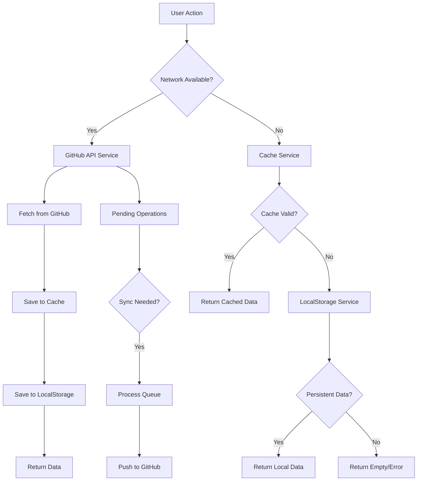

# Offline-First Implementation Plan

## Executive Summary

The Flutter GitHub Issues Todo app requires offline-first architecture with full caching and automatic sync when connectivity is restored. This plan outlines the implementation steps to fix existing issues and add missing functionality.

## Current Architecture Analysis

### Existing Components

| Component | Status | Purpose |
|-----------|--------|---------|
| CacheService | ⚠️ Broken | TTL-based cache (5 min default) |
| NetworkService | ✅ Working | Connectivity monitoring |
| SyncService | ⚠️ Partial | Manual sync, auto-sync on reconnect |
| LocalStorageService | ✅ Working | Persistent storage for issues/repos |
| PendingOperationsService | ✅ Working | Queue for offline mutations |

### Identified Issues

1. **CacheService.get()** - Line 137-141: Calls `init()` without `await`, always returns null
2. **GitHubApiService** - Network failures throw exceptions instead of returning cached data
3. **No persistent fallback** - Only TTL cache, no fallback to LocalStorageService when cache expires
4. **Providers don't check network** - `reposProvider` and `issuesProvider` don't check connectivity before API calls

## Implementation Phases

### Phase 1: Fix Critical Cache Issues (P0)

#### 1.1 Fix CacheService.get() async initialization
**File:** `lib/services/cache_service.dart`
**Lines:** 135-142

```dart
T? get<T>(String key) {
  // FIX: Must be async-compatible or use getAsync
  if (!_isInitialized) {
    // Option A: Use getAsync internally (recommended)
    return null;
  }
  // ... rest of method
}
```

**Recommended Fix:** Update `get()` to be properly async or use `getAsync()` pattern.

#### 1.2 Verify CacheService.init() is called in main.dart
**File:** `lib/main.dart`
**Status:** ✅ Already fixed (line 68)

---

### Phase 2: Offline-First Data Flow (P1)

#### 2.1 Modify GitHubApiService to return cached data on network failure
**File:** `lib/services/github_api_service.dart`

Add fallback logic in catch blocks:
```dart
} catch (e, stackTrace) {
  AppErrorHandler.handle(e, stackTrace: stackTrace);
  
  // Return cached data on network failure
  if (e is SocketException || e is TimeoutException) {
    final cachedData = _cache.get<List>(cacheKey);
    if (cachedData != null) {
      debugPrint('Returning cached data due to network error');
      // Parse and return cached data
    }
  }
  rethrow;
}
```

#### 2.2 Add network check before API calls
**File:** `lib/services/github_api_service.dart`

Add method to check connectivity:
```dart
Future<bool> get isOnline async {
  final connectivity = await Connectivity().checkConnectivity();
  return connectivity.any((r) => r != ConnectivityResult.none);
}
```

---

### Phase 3: Persistent Storage Fallback (P2)

#### 3.1 Save to LocalStorageService after successful fetch
**File:** `lib/services/github_api_service.dart`

After successful API calls, also save to LocalStorageService for long-term persistence:
```dart
// In fetchMyRepositories after successful response:
await _localStorage.saveRepos(repos.map((r) => r.toJson()).toList());

// In fetchIssues after successful response:
await _localStorage.saveSyncedIssues('$owner/$repo', issues);
```

#### 3.2 Load from LocalStorageService when cache expires
**File:** `lib/services/github_api_service.dart`

When cache returns null, fall back to LocalStorageService:
```dart
// In fetchMyRepositories:
var repos = _cache.get<List>('repos_page_$page');
if (repos == null) {
  // Fallback to local storage
  final localRepos = await _localStorage.getRepos();
  if (localRepos.isNotEmpty) {
    return localRepos.map((r) => RepoItem.fromJson(r)).toList();
  }
}
```

---

### Phase 4: Offline-First Providers (P1)

#### 4.1 Create offline-first repository provider
**File:** `lib/providers/app_providers.dart`

```dart
final offlineReposProvider = FutureProvider<List<RepoItem>>((ref) async {
  final api = ref.read(githubApiServiceProvider);
  final network = NetworkService();
  
  try {
    // Try online first
    if (await network.checkConnectivity()) {
      return await api.fetchMyRepositories(perPage: 30);
    }
    throw const SocketException('Offline');
  } catch (e) {
    // On failure, GitHubApiService will return cached data
    return await api.fetchMyRepositories(perPage: 30);
  }
});
```

#### 4.2 Create offline-first issues provider
**File:** `lib/providers/app_providers.dart`

```dart
final offlineIssuesProvider = FutureProvider.family<List<IssueItem>, String>((
  ref,
  repoFullName,
) async {
  final api = ref.read(githubApiServiceProvider);
  final parts = repoFullName.split('/');
  
  try {
    if (await NetworkService().checkConnectivity()) {
      return await api.fetchIssues(parts[0], parts[1]);
    }
    throw const SocketException('Offline');
  } catch (e) {
    return await api.fetchIssues(parts[0], parts[1]);
  }
});
```

---

### Phase 5: UI Indicators and Sync Status (P2)

#### 5.1 Add offline banner to main dashboard
**File:** `lib/screens/main_dashboard_screen.dart`

Add connectivity indicator:
```dart
// In build method, add connectivity banner
Consumer<Connectivity>(
  builder: (context, connectivity, child) {
    if (connectivity == ConnectivityResult.none) {
      return Container(
        color: Colors.orange,
        child: const Text('You are offline'),
      );
    }
    return const SizedBox.shrink();
  },
)
```

#### 5.2 Show pending operations count
**File:** `lib/widgets/sync_status_widget.dart`

Enhance to show pending operations:
```dart
// Add pending operations count indicator
final pendingCount = ref.watch(pendingOperationsServiceProvider).getPendingCount();
if (pendingCount > 0) {
  return Badge(label: Text('$pendingCount'), child: ...);
}
```

---

### Phase 6: Background Sync Enhancement (P3)

#### 6.1 Improve Workmanager sync reliability
**File:** `lib/main.dart`

Current implementation registers periodic task but may fail on network check. Consider:
- Add exponential backoff for failed syncs
- Add immediate sync trigger on network restoration
- Store sync attempts for retry

#### 6.2 Add sync conflict resolution UI
**File:** `lib/widgets/conflict_resolution_dialog.dart`

Ensure conflicts are handled properly:
- Detect when local and remote changes conflict
- Show dialog to user for resolution options
- Options: Keep local, Keep remote, Merge

---

## File Modification Summary

| File | Changes | Priority |
|------|---------|----------|
| lib/services/cache_service.dart | Fix get() async issue | P0 |
| lib/services/github_api_service.dart | Add offline fallback + local storage | P1 |
| lib/providers/app_providers.dart | Add offline-first providers | P1 |
| lib/screens/main_dashboard_screen banner.dart | Add offline | P2 |
| lib/widgets/sync_status_widget.dart | Show pending count | P2 |
| lib/main.dart | Verify background sync reliability | P2 |

---

## Testing Plan

### Unit Tests
- CacheService.get() with uninitialized cache
- CacheService.get() with expired cache
- GitHubApiService fallback on SocketException
- LocalStorageService.getRepos() empty state

### Integration Tests
- Create issue offline, verify local storage
- Go online, verify sync
- Multiple offline issues queued for sync
- Offline mode shows vault repository

---

## Architecture Diagram



---

## Success Criteria

1. ✅ App loads cached data when offline
2. ✅ App shows offline indicator when disconnected
3. ✅ Offline-created issues queue for sync
4. ✅ Automatic sync when connectivity restored
5. ✅ Background sync works reliably
6. ✅ No data loss on offline/online transitions
